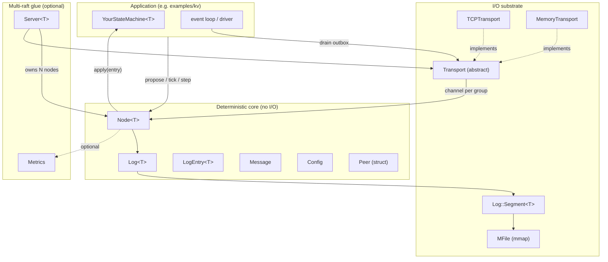
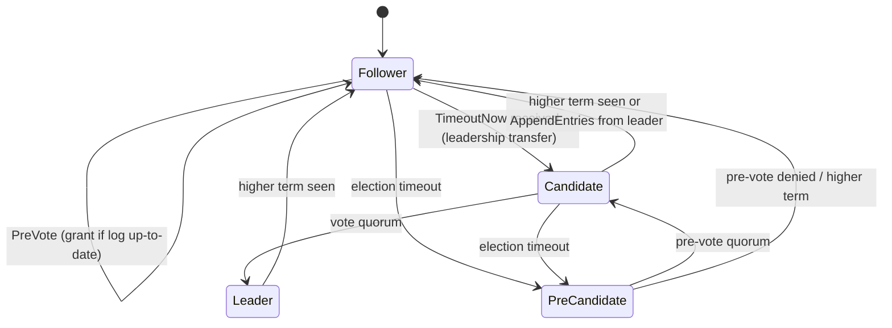
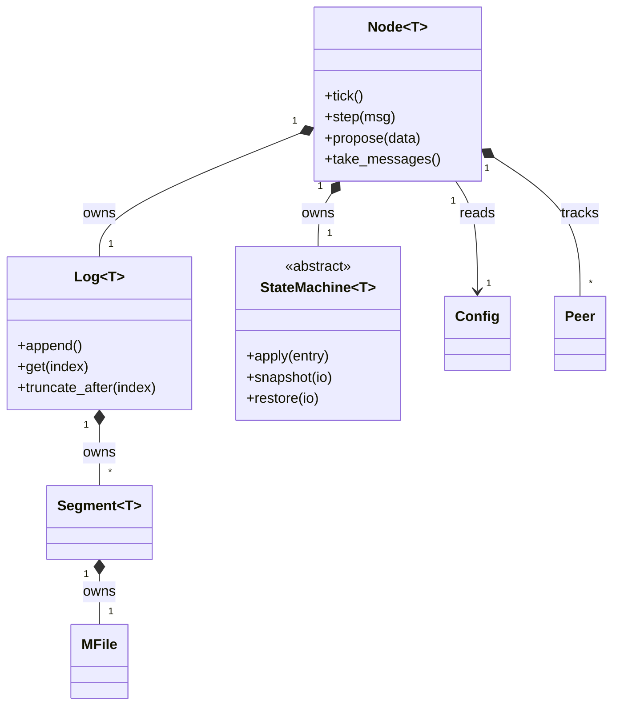
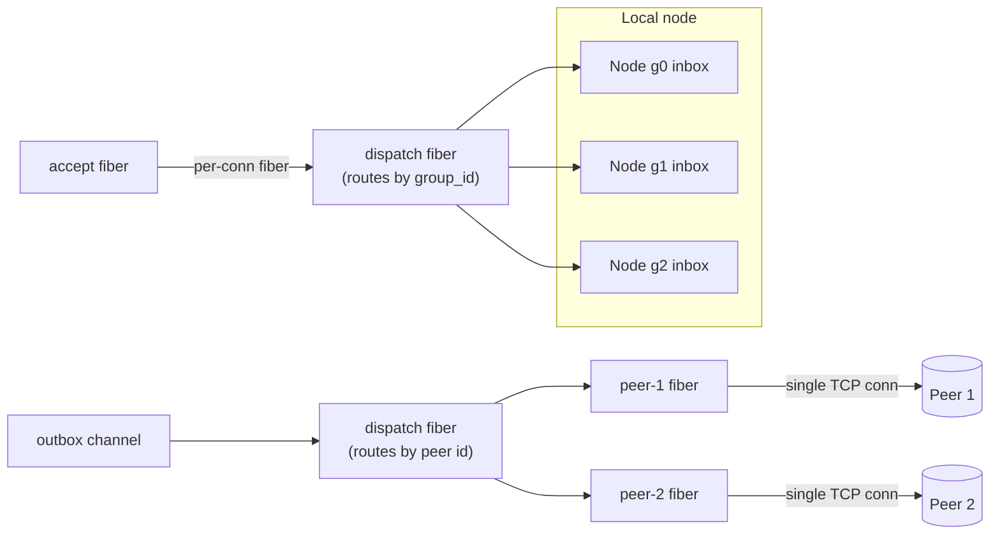
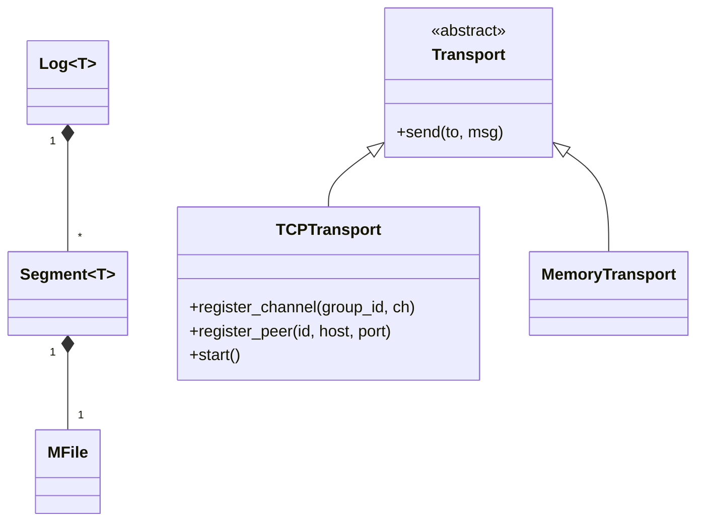
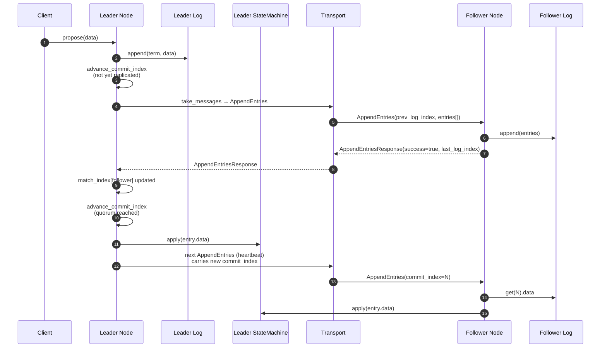
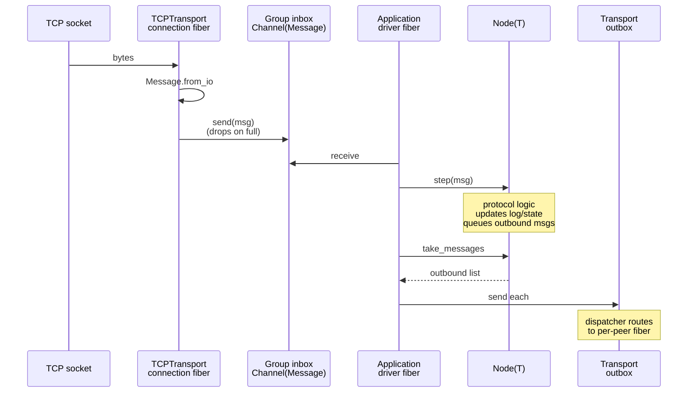

# Architecture

This document describes how the Raft library is structured, how the pieces fit together, and the design decisions behind them. It supersedes the older design documents in `docs/plans/` (which remain for historical reference).

It serves three audiences at once:

- **New contributors** — what each file does, where to make changes, and what invariants to preserve.
- **Library users / integrators** (e.g. embedding this in LavinMQ) — what the library guarantees, what it does not, and which extension points to use.
- **Future you** — the rationale behind the trade-offs, so you don't have to re-derive them.

## 1. Overview & goals

A fast, embeddable Raft consensus library for Crystal. The library implements the Raft protocol mechanics; the consuming application supplies the data type, the state machine, and (optionally) the transport.

**What it does:**

- Leader election with **pre-vote** (avoids term inflation from partitioned nodes)
- Log replication with fast log-conflict resolution
- Persistent state (term / vote / configuration) with crash-safe writes
- Single-server membership changes with **learners** (non-voting members)
- Leadership transfer
- Multi-raft on a single shared transport
- Segmented, mmap-backed log on disk
- Prometheus metrics

**What it does not (yet) do:**

- **Linearizable reads** — no `ReadIndex` or leader lease. The application is responsible for reading state safely (e.g. by going through the leader, or accepting eventual consistency).
- **Built-in clients** — there is no client-side library; the application defines its own RPC layer.

**Target use cases:** key-value stores, AMQP broker quorum queues (multi-raft), and similar consensus-backed services where the host application owns the I/O loop.

## 2. The big picture

The library is layered. The deterministic Raft protocol sits on top, completely free of I/O. Below it, the I/O substrate handles disk and network. A small multi-raft glue layer ties them together for applications that want it.



**The central design rule:** the core never does I/O. `Node` has no sockets, no fibers, no disk writes outside of `persist_state` (a single small metadata file written via tmp+rename+fsync). Everything time-based is driven by `tick()`. Everything network-based is driven by `step(message)` and consumed via `take_messages`. Everything log-shaped is delegated to `Log`, which in turn delegates the bytes-on-disk concern to `Segment` and `MFile`.

This rule has practical consequences:

1. **The protocol is testable without setup.** Tests step messages into nodes deterministically; no clocks, no sockets, no fakes for I/O.
2. **The host application owns the event loop.** A broker can integrate this library into its existing fibers without surrendering scheduling control.
3. **Transports are pluggable.** Replacing `TCPTransport` with an in-broker transport is a matter of implementing `Transport#send` and feeding messages into the per-group inbox channels.

## 3. The deterministic core

These classes implement the Raft protocol. They contain no networking code and no fibers. The only disk write any of them performs is `Node#persist_state`, which writes a small metadata file (current term, vote, configuration) using a tmp+rename+fsync pattern.

### `Raft::Node(T)`

The heart of the protocol. Generic over `T` — the application's command type. Owns one `Log(T)`, one `StateMachine(T)`, and a `Config`.

**Public surface:**

- `tick` — advance internal counters by one. Drives election timeouts and heartbeat scheduling.
- `step(message : Message)` — consume an inbound message. Branches by `MessageType`; may produce outbound messages or commit log entries.
- `propose(data : T) : Bool` — append a log entry as leader. Returns `false` if not leader.
- `take_messages : Array({NodeID, Message})` — drain the outbox. Caller is responsible for sending the messages.
- `bootstrap : Bool` — bring up a single-node cluster (used to start the very first node).
- `add_server` / `remove_server` / `promote_learner` — reconfiguration operations (leader-only).
- `transfer_leadership(to:)` — initiate leadership transfer.
- `on_configuration_change` / `on_configuration_applied` — callbacks fired when membership changes.

**Inputs and outputs:**

- Inbound messages can be delivered either via `step(msg)` (synchronous) or via `Node#inbox`, a `Channel(Message)` provided as a convenience for applications that prefer a `select` loop. Both paths feed the same `step` logic — the channel is just a queueing convenience.
- Outbound messages accumulate in an internal array and are drained by `take_messages`. They are *not* sent automatically; the caller drains and forwards them to the transport.

**Roles and transitions:**



`PreCandidate` is not a separate enum value — pre-vote runs while the role is still `Follower` (or `Candidate` in the case of split-vote retries). The diagram shows it as a state to make the flow clearer; in code, pre-vote is gated by `start_pre_vote` and tracked via `@pre_votes_received`.

**Key invariants the implementation maintains:**

- **Term safety:** the leader only commits entries from its own term (`advance_commit_index` skips any entry whose term is not `@current_term`). This prevents the well-known scenario where a leader could otherwise commit a stale entry from a previous term.
- **Election restriction:** a vote is granted only if the candidate's log is at least as up-to-date as the voter's (last-term-then-last-index comparison).
- **Configuration entries are applied as soon as they are stored in the log**, before commit. This follows the safety-improved variant of single-server membership changes from Diego Ongaro's PhD thesis. If the entry is later rolled back, the node steps down (see `apply_configuration_from_entry`).
- **Persisted state is fsynced on every change** that affects safety: term increments, vote grants, configuration changes, and commit advances all trigger `persist_state`.

### `Raft::Log(T)`

The replicated log. Append-only, segmented, indexed by 1-based `index`. Each `LogEntry(T)` carries a term, an index, an `EntryType` (`Normal`, `Configuration`, or `Noop`), and either typed `data : T?` or raw `config_data : Bytes`.

**Public surface:**

- `append(term:, data:, entry_type:, config_data:)` — append a new entry.
- `get(index) : LogEntry(T)` — random read by index.
- `term_at(index)` — read just the term (used during AppendEntries consistency checks).
- `truncate_after(index)` — discard all entries with index > `index`. Used when a follower rejects entries due to a term mismatch.
- `last_index`, `last_term` — log head.
- `reset` — wipe the log (used when the local node is removed from the cluster).

`Log` itself is a thin orchestrator: it owns a list of `Segment(T)` instances, decides when to roll over to a new segment (when the current one has no capacity for the next entry), and dispatches reads to the right segment. The actual byte-level concerns live in `Segment` and `MFile`.

**Recovery on startup** (`recover_segments`): `Log` lists `*.log` files in the data directory, sorts them lexicographically (their names are zero-padded first-indices, so this sorts correctly), opens each one, and rebuilds the in-memory offset tables. Partial trailing entries from a crash are handled by `Segment#recover` (see §4).

### `Raft::LogEntry(T)`

A struct with on-disk and on-wire serialization. Layout:

```
┌──────────┬──────────┬──────────┬──────────┬──────────┐
│ term     │ index    │ type     │ size     │ payload  │
│ UInt64   │ UInt64   │ UInt8    │ UInt32   │ variable │
└──────────┴──────────┴──────────┴──────────┴──────────┘
```

For `Normal` entries the payload is `T#to_io` bytes. For `Configuration` entries the payload is the serialized peer list. `Noop` entries have a zero payload — they are appended on leader election to force log convergence on followers.

### `Raft::StateMachine(T)`

Abstract class the application subclasses:

```crystal
abstract def apply(entry : T)
abstract def snapshot(io : IO)
abstract def restore(io : IO)
```

`apply` is invoked synchronously by the node every time the commit index advances past an entry. **There is no channel, no fiber, no allocation per entry** — it is a direct virtual dispatch. The cost of applying an entry is the cost of the user's `apply` method plus one virtual call.

`snapshot` and `restore` are invoked by the core as part of snapshot management (see §6.5).

### `Raft::Message`

A struct holding all fields used across all message types — `AppendEntries`, `RequestVote`, `PreVote`, `TimeoutNow`, etc. — plus `InstallSnapshot` enum values that are not yet wired up. A `protocol_version` byte sits at the front for forward compatibility, and `group_id` follows so that one transport can multiplex messages across many raft groups (see §5).

The wire format is fixed-layout little-endian — no framing layer, no length prefix on the message itself (the receiver knows the structure). The `entries_data` payload carries already-serialized `LogEntry(T)` bytes; the node deserializes them using `T#from_io` on the receiving side.

### `Raft::Config`

A small struct of tunables read at construction time:

| Field | Default | What it controls |
|---|---|---|
| `tick_interval` | 50ms | How often the application is expected to call `tick()` |
| `heartbeat_ticks` | 2 | Heartbeat period, in ticks (2 × 50ms = 100ms) |
| `election_timeout_min_ticks` | 10 | Election timeout lower bound (500ms) |
| `election_timeout_max_ticks` | 20 | Election timeout upper bound (1000ms) |
| `max_segment_size` | 64 MB | Log segment rollover threshold |
| `max_append_entries_size` | 1 MB | Cap on `entries_data` per AppendEntries message |
| `snapshot_chunk_size` | 1 MB | Chunk size for InstallSnapshot RPC payloads |
| `snapshot_interval_entries` | 1000 | Trigger snapshot after this many committed entries |
| `data_dir` | `"data"` | Where logs and metadata live |

`Config` is not modified after a `Node` is constructed.

### `Raft::Peer`

A plain-data struct: `id : NodeID`, `role : Voter | Learner`, `address : String`. Used both as in-memory peer state on the `Node` and as the on-disk format inside `Configuration` log entries. The address travels through the Raft log itself, which means a new server learns where to reach its peers from the very log entries it replicates — no separate peer-discovery protocol is required.

### How the core classes are linked



`Node` owns its `Log` and `StateMachine` for life. `Config` is held by reference but treated as read-only. Messages flow into the node as values (no shared mutable state across the boundary) and out as values. There is exactly one place where the core touches the filesystem directly: `persist_state` and `recover_state` write/read a single `raft_meta` file. Everything else on disk is the log, owned by `Log` / `Segment` / `MFile`.

## 4. The I/O substrate

These classes do touch the filesystem and the network. They are kept dependency-light: nothing in this layer knows about `Node` or the Raft protocol. They expose primitive operations and let the layer above orchestrate.

### `MFile`

A memory-mapped file primitive originally lifted from LavinMQ. Exposes `IO` semantics (`read`, `write`, `seek`, `pos`, `size`) but is backed by an `mmap` region.

Two important behaviors:

1. **Capacity vs. size.** When opened for write, the file is allocated to a fixed `capacity` up front (via `ftruncate`); `size` tracks the logical end of valid data. On graceful close the file is truncated back to `size`. On crash the file remains capacity-sized with garbage at the tail — recovery has to scan to find the valid end. This trades some recovery work for the ability to avoid `ftruncate` on every append.
2. **Zero-copy reads.** Because the file is mmapped, reads are just pointer dereferences into the page cache. This is also a stepping stone toward `socket.sendfile` for AppendEntries replication, which would let the leader stream log bytes from the page cache directly to the socket without copying through user space.

### `Raft::Log::Segment(T)`

One log segment file. Owns one `MFile` and an in-memory offset array `@offsets : Array(UInt64)` mapping `index → byte offset within the file`. A segment can be read by index (O(1) lookup, then a deserialize from the mmap region), appended to, or truncated.

The segment filename is the zero-padded first index it contains: `0000000000000001.log`, `0000000000010001.log`, etc. This makes lexicographic directory listing equal to chronological order.

**Recovery on open** (`recover`): scan the file from offset 0, deserializing one `LogEntry(T)` at a time, recording each entry's offset. If a `from_io` call raises (partial write at the tail of a crashed file), record the last fully-valid offset as `valid_end` and `resize` the mmap region down to it. This makes recovery idempotent: any tail garbage from a crash is silently dropped.

### `Raft::Transport` (abstract)

```crystal
abstract class Transport
  abstract def send(to : NodeID, message : Message)
end
```

That is the entire abstract interface. In practice a concrete transport also needs:

- A way for `Node`s to register their inbox channels per `group_id` so the transport knows where to route inbound messages.
- A way to register peer addresses.
- A way to start and stop.

These are exposed as concrete methods on `TCPTransport` (`register_channel`, `register_peer`, `start`, `stop`) but are not part of the abstract base, since alternate transports may handle them differently.

### `Raft::TCPTransport`

The reference TCP implementation. The concurrency model is the load-bearing part of the design and is worth describing in detail.



Inbound:

1. An **accept fiber** accepts new TCP connections and spawns a per-connection fiber.
2. Each connection fiber reads `Message` structs in a loop. For each message it looks up the destination group's inbox channel and tries to send. If the inbox is full, the message is dropped and `raft_transport_inbox_drops_total{peer="..."}` is incremented.

Outbound:

1. The **dispatch fiber** consumes `(NodeID, Message)` from the shared `outbox` channel and routes each message into the destination peer's outbox channel.
2. A **per-peer fiber** drains that peer's outbox and writes to the single TCP connection for that peer. If the per-peer outbox is full, the message is dropped (`raft_transport_outbox_drops_total{peer="..."}`).

**Why drops are safe:** Raft retries naturally. If an AppendEntries is dropped, the leader will resend it on the next heartbeat; if a vote is dropped, the candidate will re-issue on its next election timeout. Dropping under backpressure is preferable to unbounded queueing or blocking the protocol fibers.

The dispatch fiber also serves a second role: it serializes registration commands (`register_channel`, `register_peer`, `unregister_channel`) through the same channel that delivers outbound messages. This means a node coming online cannot race with the dispatcher reading from a not-yet-registered group's channel — registration and dispatch are linearizable by virtue of being on the same `select`.

Peer addresses are persisted to a `transport_peers` file in the data directory and recovered on startup, so a transport that learns peers via Raft configuration entries doesn't lose them across restarts.

### `Raft::MemoryTransport`

An in-process transport used by the test suite. Lets multiple `Node`s share a hash of channels with no networking. Useful as a reference for the minimum implementation surface a custom transport needs.

### How the I/O layer is linked



Three things to notice:

1. **`Log` doesn't know about `MFile`**, only about `Segment`. The mmap detail is encapsulated.
2. **`Transport` doesn't know about `Node`.** It sees a `Channel(Message)` and a `group_id` and that's it. This is what lets a host application replace the transport without touching the protocol code.
3. **There is no shared state between transports and the core** other than the channels and the `Message` values that flow through them.

## 5. Multi-raft & lifecycle

### `Raft::Server(T)`

An optional convenience class for running multiple raft groups. Owns a hash of `Node(T)` instances keyed by `group_id`, a single shared `Config` template, and a ticker fiber that calls `tick` on every node at `config.tick_interval`.

```crystal
server = Raft::Server(MyCmd).new(config)
server.add_group(group_id: 1_u64, node_id: 1_u64, peers: [...], state_machine: sm1)
server.add_group(group_id: 2_u64, node_id: 1_u64, peers: [...], state_machine: sm2)
server.start_ticker
```

Per-group data directories are derived from the base config: `<base>/group-<id>/`. Each group gets its own log, its own metadata file, and its own state machine.

`Server` is **optional**. The KV example does not use it; it manages its own per-group event loops directly so that it can use a `select` over `node.inbox` and a tick timer. Use `Server` when you want the simple path; bypass it when you need finer control of the loop.

### `Raft::Metrics`

Per-`Node` Prometheus metrics. Exposes counters, gauges, and histograms with labels. Every metric is automatically labeled with the owning `node_id` and `group_id`. The metric *names* match the conventions used by other Raft implementations (`raft_proposals_total`, `raft_commit_advances_total`, `raft_state_transitions_total{from,to}`, etc.) — there is no internal abstraction; metric names are written as string literals at the `@metrics.try(&.increment(...))` call sites.

`Metrics` is a `Node` parameter, optional and nilable. The `try(&.increment(...))` pattern means metric calls are no-ops when metrics are disabled, with no allocation cost.

### Lifecycle of a write

This is what happens end-to-end when a client wants to commit a value.



Two things that are easy to miss in a diagram:

- **Commit happens when a quorum of followers has replicated the entry**, including the leader itself. `advance_commit_index` only commits entries from the leader's *current* term, even if older entries appear quorum-replicated; this is the term-safety rule from §3.
- **Followers learn the commit index from a subsequent message.** The leader does not send a separate "commit" RPC; it just piggybacks the new `commit_index` on the next AppendEntries (which may be a heartbeat with no entries). This means there is always a one-round-trip lag between leader-side commit and follower-side apply.

### Lifecycle of an inbound message



The application driver is the explicit owner of the loop: it pulls a message from the inbox, calls `step`, drains the outbox, and forwards messages to the transport. The KV example uses a `select` between the inbox and a 50ms timeout that drives `tick`. Applications using `Raft::Server` get a built-in ticker fiber but still need to wire up the inbox/outbox path themselves.

### Shutdown and persistence

- `Node#close` closes the inbox channel and the log (which closes all segments, which gracefully truncate their `MFile`s back to logical size).
- `Transport#stop` closes the listener, drains command/outbox channels, and closes peer connections.
- Crash safety: term/vote/configuration are durable on every change (`persist_state` writes `raft_meta.tmp`, fsyncs, and renames). The log is recovered on next start by `Log#recover_segments` + `Segment#recover`, which truncates any partial trailing entry.

## 6. Performance & design decisions

The trade-offs that shape the library's characteristics. Each item is presented as **decision → consequence → cost**.

### Deterministic core, no I/O in `Node`

**Decision:** `Node` does no networking, no fibers, and only one small disk write (`persist_state`). All I/O is driven externally via `tick`, `step`, and `take_messages`.

**Consequence:** the protocol is testable without sockets or sleeps. Tests step messages between in-memory nodes and assert state transitions. This is the single biggest source of correctness leverage in the library — Raft bugs tend to be subtle, and not having to fight a test harness while finding them matters a lot.

**Cost:** the application has to drive the loop (or use `Raft::Server`). There is a small extra hop on every inbound message (`channel → loop → node` instead of `channel → node`), but this hop is also where any host-specific concerns (rate limiting, custom telemetry) can be inserted.

### Generic `T` with `to_io` / `from_io`

**Decision:** the log is generic over the application's command type `T`, which must implement `to_io(io)` and `self.from_io(io)`.

**Consequence:** no JSON, no MessagePack, no schema layer in the hot path. The application picks its own encoding and pays exactly the cost it chooses. For the KV example the encoding is a few `write_bytes` calls per command.

**Cost:** the application must handle versioning of its own type. There is no built-in schema-evolution story.

### Memory-mapped, capacity-allocated segments

**Decision:** log segments are mmapped via `MFile` and allocated to a fixed capacity (default 64 MB) on first open. Reads are pointer dereferences; appends are memory writes; segment rollover happens when the next entry would exceed capacity.

**Consequence:**

- Reads do not copy out of the page cache. Replication, recovery, and inspection all benefit.
- Writes are durable through the page cache without explicit `write` syscalls.
- The file layout is a stepping stone for `socket.sendfile` zero-copy AppendEntries (not yet implemented but intentionally not foreclosed).

**Cost:** files are capacity-sized on disk while they're hot. A node with 64 raft groups and one open segment per group reserves ~4 GB of disk for unfilled-but-allocated segment space until those segments are sealed and rolled. On graceful close, segments are truncated back to logical size. On crash, recovery scans to find the valid end and resizes.

### Single TCP connection per peer pair

**Decision:** the transport multiplexes all raft groups on a single TCP connection per peer. Each `Message` carries a `group_id` field; the receiving transport routes by `group_id` to the appropriate node's inbox.

**Consequence:** connection count stays O(N²) in cluster size, not O(N² × groups). For multi-raft workloads (many groups, modest cluster size — the AMQP quorum-queue case) this is the difference between hundreds of connections and tens of thousands.

**Cost:** head-of-line blocking on the TCP stream — a slow large message on group A delays a small heartbeat on group B. AppendEntries is capped at `max_append_entries_size` (1 MB default) partly for this reason.

### Direct virtual dispatch on `apply`

**Decision:** `Node` calls `state_machine.apply(entry)` directly. There is no channel between the Raft thread and the state machine.

**Consequence:** zero overhead per applied entry beyond the user's code. No allocation, no fiber scheduling, no context switch. For a state machine that is itself simple (e.g. a hashmap update) this is roughly two virtual calls and a hash insert.

**Cost:** the state machine must not block. If it does, the Raft loop blocks with it. State machines that need to do I/O of their own are responsible for buffering and applying asynchronously.

### Bounded channels with drop metrics

**Decision:** all transport channels are bounded (size 64) and drop on full. Drops are counted in `raft_transport_inbox_drops_total` and `raft_transport_outbox_drops_total`, both labeled by peer ID.

**Consequence:** backpressure is bounded and visible. The system never deadlocks on a slow peer, and operators can see exactly which peers are dropping in Prometheus.

**Cost:** dropped messages mean retransmissions. This is fine because Raft retries naturally — every message will be re-sent on the next heartbeat or election timeout — but it does mean a saturated peer is slower than a healthy one in a measurable way.

### Pre-vote

**Decision:** before incrementing its term to start an election, a candidate sends `PreVote` messages and only transitions to `Candidate` (and increments its term) if it would have won the real election. `PreVote` messages do not cause term bumps in voters.

**Consequence:** a partitioned node returning to the cluster does not force a step-down by virtue of having advanced its term during isolation. Term inflation is avoided.

**Cost:** one extra round-trip per election in the rare case where the election would have succeeded anyway. For multi-raft workloads with many groups, this matters because partition-induced churn is otherwise multiplied by group count.

### Configuration entries applied immediately

**Decision:** when a follower receives a `Configuration` log entry, it applies the new peer set to its in-memory state immediately, without waiting for the entry to commit.

**Consequence:** new servers can vote and replicate as soon as they see the entry; removed servers stop participating immediately. This matches the safety-improved single-server membership change variant from Diego Ongaro's PhD thesis.

**Cost:** if the configuration entry is later rolled back (the leader fails before committing it), nodes need to revert. The implementation handles this by stepping down to follower with the old peer list when removed by an uncommitted entry, and by deferring the destructive cleanup (`@log.reset`) until commit time.

### `Time.instant` rather than `Time.monotonic`

**Decision:** monotonic timing in the TUI uses `Time.instant`.

**Consequence:** `Time.monotonic` returns a value relative to an arbitrary process-start origin and is not comparable across `Time::Span` arithmetic in some contexts; `Time.instant` is a `Time` value on a monotonic clock, which composes naturally with deadlines and durations.

**Cost:** none material; this is a Crystal API choice, noted because it's easy to reach for `Time.monotonic` by reflex.

### Execution-context-safe build

**Decision:** the library is built with `-Dpreview_mt -Dexecution_context`, which enables Crystal's multi-threaded execution contexts.

**Consequence:** raft groups can run on their own execution contexts, achieving real parallelism across cores without locks (each group's state is owned by its driving fiber). The KV example does not yet partition this way, but the library does not foreclose it.

**Cost:** care is required around shared state. The `Metrics` class is mutex-guarded for histograms; transport channels are inherently safe; the `Node`'s internal state is single-fiber-by-construction.

### What is intentionally not optimized (yet)

- **Fsync on every commit advance.** Currently `persist_state` is called on every commit advance, which fsyncs `raft_meta`. Batching would reduce the syscall cost on write-heavy workloads.
- **No write batching on the application side.** `propose` produces one log entry at a time. A future API could allow batched proposals with a single fsync.
- **No `sendfile` yet** for replication — the mmap layout supports it but the wire path still copies through `IO::Memory`.
- **Head-of-line blocking on the shared TCP connection.** The single-connection-per-peer design (see "Single TCP connection per peer pair" above) means a slow large message on one group delays everything else on the same connection. The 1 MB `max_append_entries_size` cap mitigates but does not solve this. For the AMQP use case where individual user messages can be much larger than 1 MB, four mitigation paths exist:
  1. **Don't put bodies in the Raft log.** The Raft log carries metadata + a reference; bodies live in a separate per-node store and replicate out-of-band. This is what RabbitMQ quorum queues do via the shared message store and is the recommended pattern for a quorum-queue integration. The Raft library's job is consensus on a small ordered metadata stream; bulk transfer is a separate concern with different requirements.
  2. **Multiple TCP connections per peer pair** — typically a "control" connection (heartbeats, votes, small AppendEntries) plus a "bulk" connection. Cheap to implement, reversible, retains most of the multi-raft connection-count benefit. The right fix when option 1 isn't applicable.
  3. **gRPC / HTTP/2 streams** — reduces application-layer HOL but TCP-layer HOL persists; significant complexity for partial benefit.
  4. **QUIC** — eliminates TCP HOL because each stream retransmits independently. The right answer long-term but immature for this workload.

  None of these is implemented today; the structure of `Transport` makes #1 and #2 straightforward to add without touching the protocol core.

## 6.5. Raft spec compliance

Honest accounting of what is and isn't implemented relative to the Raft paper and Diego Ongaro's PhD thesis.

| Feature | Status | Notes |
|---|---|---|
| Leader election | ✅ Implemented | Randomized timeouts within `[election_timeout_min_ticks, election_timeout_max_ticks]`. |
| Log replication (AppendEntries) | ✅ Implemented | Uses `reject_hint` for fast log-conflict resolution (no per-index probing). |
| Term safety on commit | ✅ Implemented | Leader only commits entries from its current term. |
| Election restriction | ✅ Implemented | Last-term-then-last-index up-to-date check. |
| Pre-vote | ✅ Implemented (extension) | Avoids term inflation from partitioned nodes. |
| Persistent state | ✅ Implemented | Term, vote, and configuration; tmp+rename+fsync. |
| Crash-safe log | ✅ Implemented | Partial trailing entries dropped on recovery. |
| Single-server membership changes | ✅ Implemented | `add_server` / `remove_server` / `promote_learner`. |
| Learners (non-voting members) | ✅ Implemented | Auto-promoted when caught up. |
| Leadership transfer | ✅ Implemented | `transfer_leadership` + `TimeoutNow`. |
| Joint consensus (multi-server changes) | ❌ Not implemented | Not needed if single-server changes are sufficient (which the paper argues they are). |
| Snapshots / log compaction | ✅ Implemented | `Node` invokes `StateMachine#snapshot`/`restore`; snapshot persisted to a single `snapshot` file (`[index][term][peer_len][peers][sm_bytes]`) atomically; trigger every `Config.snapshot_interval_entries` committed entries; `InstallSnapshot` RPC chunked by `Config.snapshot_chunk_size`. Log truncates segments whose `last_index ≤ snapshot_index`. |
| **Linearizable reads** (`ReadIndex`, leader lease) | ❌ **Not implemented** | The application is responsible for read consistency. |
| Cluster bootstrap | ✅ Implemented | `Node#bootstrap` for the very first node; subsequent nodes join via `add_server`. |
| Multi-raft on shared transport | ✅ Implemented (extension) | Messages multiplexed by `group_id`. |

The remaining real gap is **linearizable reads**. The library is structured to support `ReadIndex` / leader-lease style reads — the application can already check `node.role.leader?` and `node.commit_index` — but there is no convenience helper that performs the heartbeat-confirm-leader round before a read.

## 7. KV example walkthrough

`examples/kv/` is a multi-raft key-value store that demonstrates how the library is meant to be used. It is not part of the library; treat it as a reference integration.

**Topology:**

- One **meta group** (group 0) holds a `MetaStateMachine` that maps `key → group_id`. Membership of the meta group defines cluster membership.
- One **value group** per key, each with its own `ValueStateMachine` holding that key's value. New value groups are created lazily on first write.
- All groups share one `TCPTransport`. Messages are multiplexed by `group_id`.

**Wiring** (`examples/kv/src/main.cr`):

1. Create a `TCPTransport`, start it.
2. Create the meta-group node first; register its inbox channel with the transport.
3. Use `Node#on_configuration_applied` to register peer addresses with the transport whenever a `Configuration` log entry arrives. **Peer discovery happens via the Raft log itself** — when a new server is added, its address travels in the configuration entry, and the transport learns about it as the entry replicates.
4. Use `Node#on_configuration_change` (fired on commit) to reconcile data-group memberships with the meta group's membership.
5. The application owns the per-group event loop, which is a `select` between the inbox channel and a 50ms tick timer.

**Leader proxy:** the HTTP handler accepts writes on any node. If the local node isn't the leader, it forwards the request to the current leader's HTTP endpoint (the leader's address is known from the meta-group's peer list). This keeps clients oblivious to leadership.

**TUI dashboard:** `src/raft/tui/dashboard.cr` is a standalone curses-style UI for inspecting cluster state during demos and development. It uses the HTTP admin endpoints (`src/raft/http/handler.cr`) — the same endpoints the integration tests hit.

What the KV example does **not** do:

- Use `Raft::Server`. It manages per-group event loops directly to keep the `select`-based loop visible.
- Linearizable reads. Reads go to the local node's `ValueStateMachine` directly (best-effort, eventually consistent).

## 8. Extending the library

### Custom data type `T`

Implement `to_io(io)` and `self.from_io(io)`:

```crystal
struct MyCommand
  getter op : String
  getter key : String

  def initialize(@op, @key)
  end

  def to_io(io : IO, format : IO::ByteFormat = IO::ByteFormat::LittleEndian)
    io.write_bytes(@op.bytesize.to_u32, format)
    io.write(@op.to_slice)
    io.write_bytes(@key.bytesize.to_u32, format)
    io.write(@key.to_slice)
  end

  def self.from_io(io : IO, format : IO::ByteFormat = IO::ByteFormat::LittleEndian) : self
    op_size = io.read_bytes(UInt32, format)
    op_buf = Bytes.new(op_size); io.read_fully(op_buf)
    key_size = io.read_bytes(UInt32, format)
    key_buf = Bytes.new(key_size); io.read_fully(key_buf)
    new(String.new(op_buf), String.new(key_buf))
  end
end
```

The library does not constrain the encoding. Use whatever is fast and stable for your application — fixed-layout binary, MessagePack, even JSON if performance doesn't matter.

### Custom `StateMachine(T)`

Subclass `Raft::StateMachine(T)` and implement `apply`, `snapshot`, and `restore`. The core invokes all three: `apply` on every committed entry, and `snapshot`/`restore` during snapshot operations (see §6.5).

`apply` is called on the Raft loop fiber. It must not block on I/O; if your state machine does I/O, buffer or defer it.

### Custom transport

Subclass `Raft::Transport` and implement `send(to:, message:)`. You will also need:

- A way for nodes to register their inbox channels (your transport's responsibility — see how `TCPTransport#register_channel` does it via a command channel for safe concurrent registration).
- A way to deliver inbound messages to the right inbox channel (route by `message.group_id`).
- Persistence of peer addresses if you want them to survive restarts (or rely on the application to re-register on startup).

The simplest reference is `MemoryTransport` (`src/raft/transport/memory_transport.cr`), which is a few dozen lines.

### Driving without `Raft::Server`

`Raft::Server` is a convenience. Skip it when:

- You want a custom `select` loop that includes signals or other channels alongside the inbox.
- You want per-group execution contexts (real parallelism across cores).
- Your host application already has an event loop you'd rather extend than wrap.

The KV example demonstrates this pattern — see the `start_group_loop` lambda in `examples/kv/src/main.cr`.

## 9. Pointers

### File map

```
src/raft/
├── config.cr               # Config struct + NodeID alias
├── log.cr                  # Log(T) — orchestrates segments
├── log/segment.cr          # Segment(T) — one log file
├── log_entry.cr            # LogEntry(T) — on-disk/wire format
├── message.cr              # Message struct + MessageType / EntryType / Role enums
├── metrics.cr              # Prometheus metrics
├── mfile.cr                # mmap'd file primitive
├── node.cr                 # Node(T) — the protocol core
├── peer.cr                 # Peer struct (id, role, address)
├── server.cr               # Server(T) — optional multi-raft glue
├── state_machine.cr        # StateMachine(T) abstract base
├── transport.cr            # Transport abstract base
├── transport/
│   ├── memory_transport.cr # in-process, used by tests
│   └── tcp_transport.cr    # production transport
├── http/
│   └── handler.cr          # HTTP admin endpoints (peers, status, propose)
└── tui/
    ├── dashboard.cr        # curses-style cluster inspector
    └── main.cr             # TUI entry point
```

```
examples/kv/
├── src/
│   ├── main.cr             # wires up transport, meta + value groups
│   ├── kv_command.cr       # the T type
│   ├── kv_state_machine.cr # base for meta and value state machines
│   ├── meta_state_machine.cr   # key → group_id mapping
│   ├── value_state_machine.cr  # one key's value
│   └── kv_http_handler.cr  # KV REST endpoints + SSE live UI
├── docker-compose.yml      # 3-node cluster + Prometheus + Grafana
└── grafana/                # dashboards
```

### Build flags

```sh
crystal build src/raft.cr -Dpreview_mt -Dexecution_context
```

Optional:

- `-Draft_debug` — enables `pause`, `resume`, `partition`, `heal`, `reset` methods on `Node` for deterministic test scenarios.

### Tests

```sh
crystal spec -Dpreview_mt -Dexecution_context
```

Specs are organized under `spec/` mirroring `src/`. The integration tests in `examples/kv/spec/` exercise the KV example end-to-end.

### Metrics

Prometheus endpoints expose:

- `raft_proposals_total`, `raft_commit_advances_total`, `raft_entries_applied_total`
- `raft_state_transitions_total{from,to}`, `raft_term_changes_total{reason}`
- `raft_elections_total`, `raft_votes_granted_total`, `raft_prevotes_granted_total`
- `raft_messages_sent_total`, `raft_messages_received_total`, `raft_heartbeats_*_total`
- `raft_log_truncations_total`, `raft_log_entries_sent_total`, `raft_log_entries_received_total`
- `raft_append_entries_rejected_total{reason}`
- `raft_transport_inbox_drops_total{peer}`, `raft_transport_outbox_drops_total{peer}`
- `raft_leadership_transfers_total{result}`

Every metric is auto-labeled with `node_id` and `group_id`.
